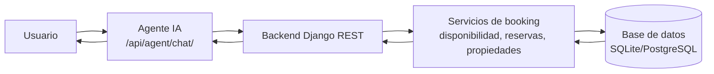

# Entrega: Agente IA para Booking

## Caso de uso

El agente ayuda a tres perfiles del sistema:

- Huesped: consulta propiedades, amenities, resenas, disponibilidad y prepara reservas.
- Anfitrion: consulta cantidad de reservas y reservas pendientes de confirmar.
- Admin: consulta reservas globales del sistema.

El agente usa datos reales del backend Django y de `db.sqlite3`. Para acciones que crean o modifican reservas, no ejecuta nada hasta recibir confirmacion explicita.

## Diagrama



## System prompt

El system prompt esta definido en `presupuesto/agent.py`, se ve en el admin como `Agente IA` y tambien se puede consultar desde:

```http
GET /api/agent/system-prompt/
```

Prompt:

```text
Sos el asistente de reservas de GuairaDevs Booking. Ayudas a huespedes a consultar
propiedades, amenities, resenas, disponibilidad y reservas; y ayudas a anfitriones a revisar
sus reservas. No respondes temas fuera de la plataforma. No buscas online: solo usas
la informacion disponible en la API/backend del proyecto. Si falta un dato, lo pedis.
Antes de crear, confirmar, cancelar o modificar una reserva, siempre pedis confirmacion
explicita y mostras el resumen de la accion.
```

## Endpoints conectados

El agente y los clientes externos pueden usar estos endpoints:

| Metodo | Endpoint | Uso |
| --- | --- | --- |
| `GET` | `/api/properties/` | Lista propiedades reales con anfitrion y amenities. |
| `GET` | `/api/properties/{id}/` | Detalle de una propiedad. |
| `GET` | `/api/amenities/` | Lista amenities. |
| `GET` | `/api/availability/?start_date=YYYY-MM-DD&end_date=YYYY-MM-DD&guests=2` | Consulta disponibilidad y precios estimados. |
| `GET` | `/api/reservations/?host_id=2&status=pendiente&month=2026-06` | Lista reservas filtradas para anfitrion. |
| `POST` | `/api/reservations/` | Crea reserva directa desde API. |
| `POST` | `/api/agent/chat/` | Conversacion del agente con interpretacion de intenciones. |

## Evidencia en el admin

En el panel de administracion aparece el modelo `Agente IA`. Es una ficha de solo lectura con:

- Rol y descripcion del asistente.
- System prompt usado por el agente.
- Endpoints conectados al backend.
- Regla de confirmacion obligatoria antes de crear reservas.

## Ajustes del modelo de datos

- `Propiedad` separa direccion y ciudad: `calle` guarda la calle, `ubicacion` guarda la ciudad.
- `Propiedad` ahora contiene `amenities` directamente como relacion many-to-many; se elimino el modelo intermedio `PropiedadAmenity`.
- `Amenity.nombre` se normaliza a mayusculas sin acentos antes de guardarse para evitar duplicados como `wifi`, `WiFi` o `Jardin`/`Jardín`.
- `Disponibilidad` incluye `fecha_inicio_reserva` y `fecha_publicacion`.
- `Disponibilidad` esta enlazada a `Reserva` con `id_reserva` y en el admin se ve dentro de cada reserva.
- Cuando el backend crea una reserva, marca las fechas correspondientes en `Disponibilidad` como `reservada` y guarda `fecha_inicio_reserva`.

## Flujo de confirmacion de reservas

Primer mensaje:

```http
POST /api/agent/chat/
Content-Type: application/json

{
  "message": "Quiero reservar esta propiedad para el 15 de agosto en la Quinta Guaira",
  "user_id": 6
}
```

Respuesta esperada:

```json
{
  "intent": "create_reservation_needs_confirmation",
  "reply": "Puedo crear una reserva pendiente para Quinta Guaira...",
  "pending_action": {
    "type": "create_reservation",
    "data": {
      "property_id": 9,
      "guest_id": 6,
      "start_date": "2026-08-15",
      "end_date": "2026-08-16",
      "guests": 1
    }
  }
}
```

Confirmacion:

```http
POST /api/agent/chat/
Content-Type: application/json

{
  "message": "confirmo",
  "confirm": true,
  "pending_action": {
    "type": "create_reservation",
    "data": {
      "property_id": 9,
      "guest_id": 6,
      "start_date": "2026-08-15",
      "end_date": "2026-08-16",
      "guests": 1
    }
  }
}
```

Recien en este segundo paso se crea la reserva en estado `pendiente`.

## Manejo de errores

- Si faltan fechas, el agente pide entrada y salida.
- Si la propiedad no existe, pide el nombre exacto.
- Si una propiedad no tiene resenas cargadas, lo aclara sin inventar opiniones.
- Si la propiedad no esta disponible, informa que no puede crear la reserva.
- Si la pregunta esta fuera del sistema, responde que solo puede ayudar con reservas y propiedades.
- Si se intenta confirmar sin `pending_action`, responde que no hay accion pendiente.

## Como ejecutar

```powershell
python manage.py migrate
python manage.py seed_data
python manage.py runserver 127.0.0.1:8000
```

Probar disponibilidad:

```powershell
curl.exe "http://127.0.0.1:8000/api/availability/?start_date=2026-07-20&end_date=2026-07-25&guests=2"
```

Probar agente:

```powershell
curl.exe -X POST "http://127.0.0.1:8000/api/agent/chat/" -H "Content-Type: application/json" -d "{\"message\":\"Hay propiedades disponibles del 20 al 25 de julio para 2 personas?\"}"
```

## Pruebas

```powershell
python manage.py check
python manage.py makemigrations --check --dry-run
python manage.py test presupuesto
```

Resultado verificado: `9 tests OK`.
